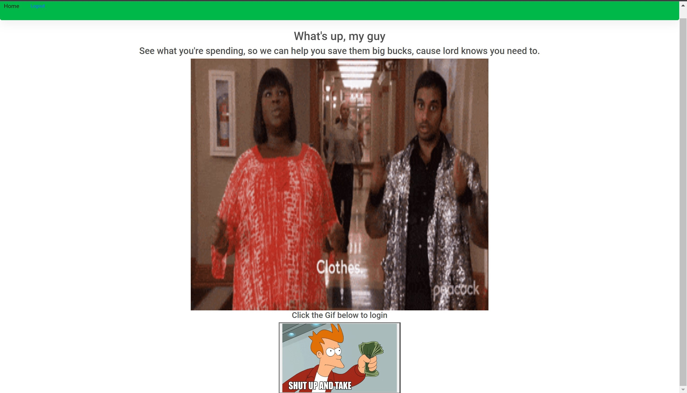
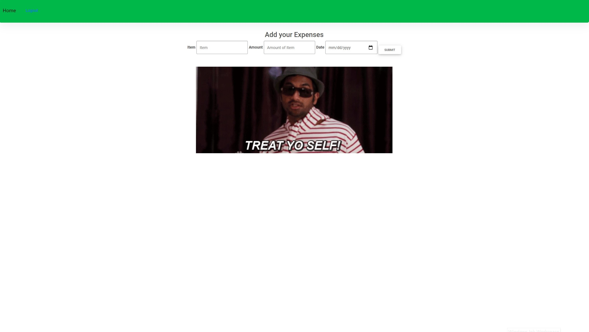
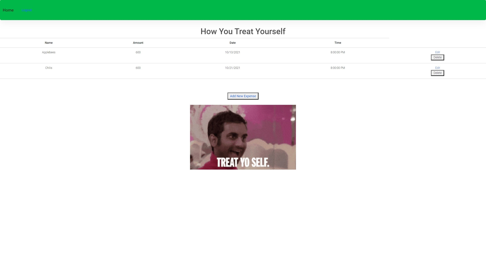
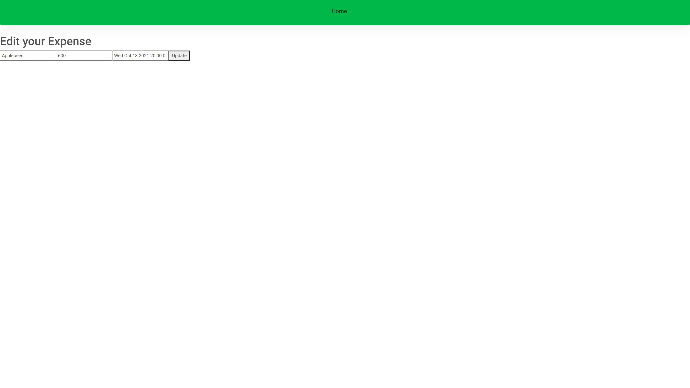
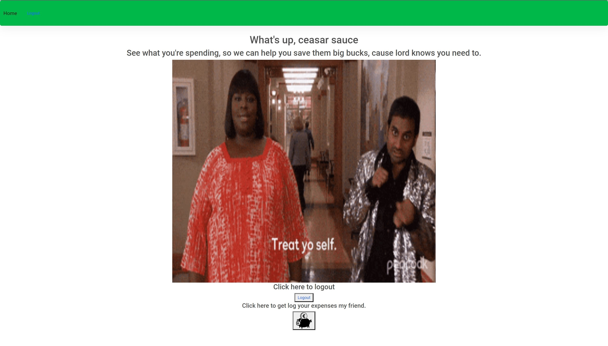

# Treat Yourself Tracker

### Description:
    One-Stop-Shop Expense tracker that logs your data inputs of your purchases, in the order of Item, Amount and Date of Purchase.

### History:
    This project idea originated from the desire to spend, and wonder where all this spending is taking place. No better way to do that than to log your expenses yourself!
    The theme of this was inspired by "Parks n' Rec" from the "Treat Yourself" episode.

### Screenshots:

### Technologies Used:
    Tools: Ubuntu, Command Line, VS.Code, Bootstrap CSS, Bootstrap CSS MDB, Git, GitHub, Node.js, MongoDB, Express, Azure, Google Cloud, Google, Youtube, StackOverflow, MDN, Chrome Dev Tools, Slack, Trello, Whimsical, Miro.
    Languages: Markdown, HTML, CSS, JavaScript. 

### Next Steps:
    -Mobile Application: Android and IOS capable.
    -State of the Art Algorithm that reads the best way to spend and save money in the future based off your past purchases.
    -Calendar feature that tracks/organizes, and organizes when you made your expenditures, by day/month/year.
    -Adverts that are specifically tailored to the user based off their previous expenses.
    -Coupon codes/Discounts of items based off Users' Purchase History
    -Add an income feature.
    -Feature that tracks your subscriptions.
    -Feature that has a reminder of when your bills are due.

### Click Here to see the app:
   [Treat Yourself](https://treat-yourself-tracker.herokuapp.com/)